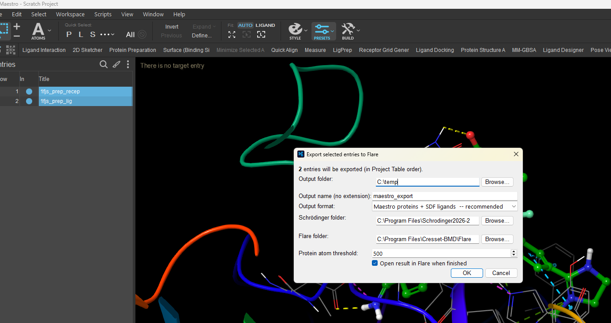
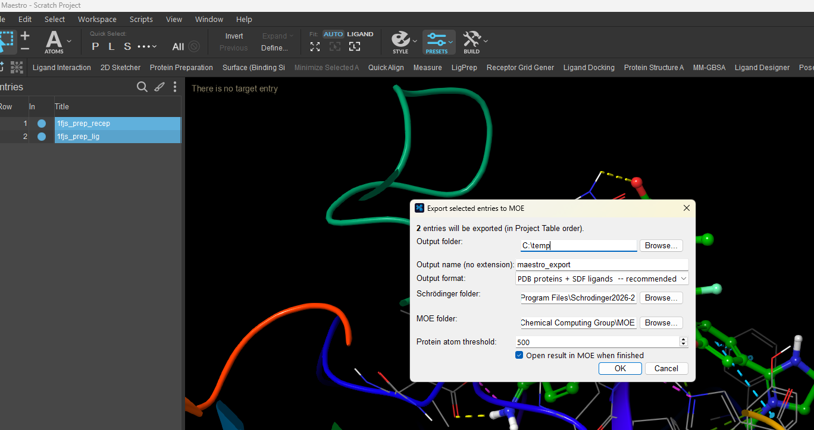
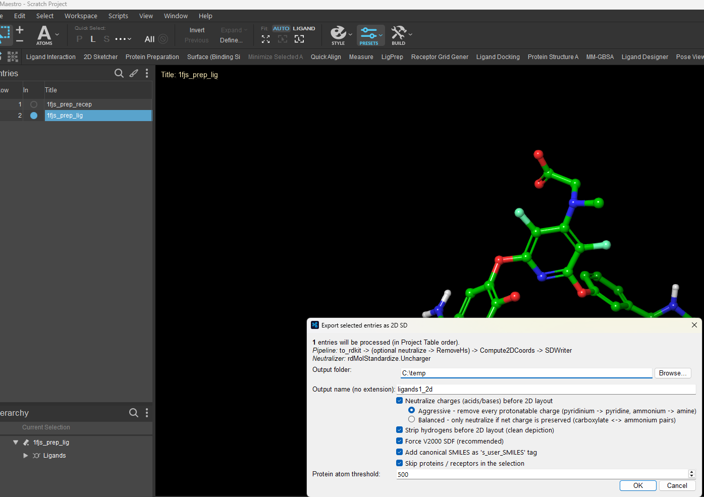
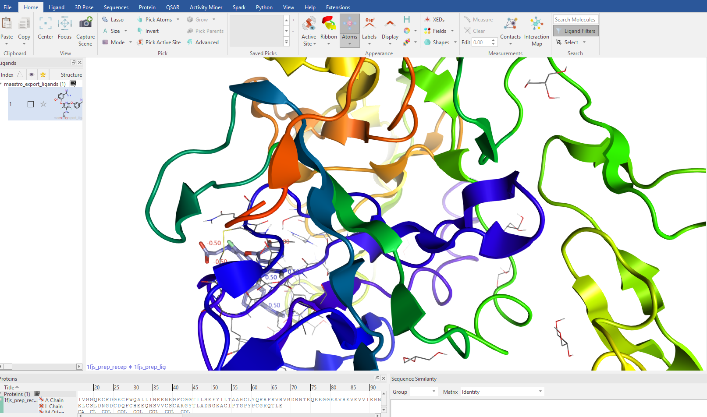

# Maestro Exporters

**One-click bridges from Schrödinger Maestro to Cresset Flare, CCG MOE, and clean 2D SD files.**

A small suite of [Maestro](https://www.schrodinger.com/platform/products/maestro/)
user scripts that take the **selected entries in your Project Table**
(typically a receptor followed by its docking poses, repeated for several
targets) and hand them off to a neighbouring tool — correctly classified as
*proteins* vs *ligands*, with metadata preserved.

Each script adds an entry under **Maestro → Scripts → User Scripts** and pops
up a small Qt dialog where you choose the output folder, format, and a couple of
options. Settings are remembered between runs.

| Script | Menu entry | What it does |
| --- | --- | --- |
| `Mae2Flare.py` | *MAE to Flare…* | Export selection to **Cresset Flare** (Proteins + Ligands tables, or a `.flrp` project) |
| `Mae2Moe.py` | *MAE to MOE…* | Export selection to **CCG MOE** (PDB + SDF, or a `.moe` session via SVL) |
| `Mae2SD2D.py` | *Selected to 2D SD…* | Convert selected ligands/poses to a single clean **2D V2000 SD file** |

---

## Screenshots

> 📸 **Placeholder — screenshots wanted!** Drop PNGs into the
> [`screenshots/`](screenshots/) folder using the filenames below and they will
> render here automatically. See [`screenshots/README.md`](screenshots/README.md)
> for capture tips.

| | |
| --- | --- |
| **MAE to Flare — export dialog** | **MAE to MOE — export dialog** |
|  |  |
| **Selected to 2D SD — options** | **Result imported in the target tool** |
|  |  |

<!-- Add more as needed, e.g.:


-->

---

## Why these exist

Moving a docked complex out of Maestro into another package usually breaks on
the same rock: the receiving tool guesses "protein or ligand?" from a heuristic
and gets it wrong, so your poses land in the wrong table (or as a giant protein).

These scripts sidestep the guesswork by writing each role in a format the target
treats unambiguously:

* **Receptors** → a format that preserves bond orders, formal charges, and the
  metadata Schrödinger has already assigned
  (`.maegz` for Flare, `.pdb` for MOE).
* **Ligands / poses** → **SDF**, whose per-record reader is treated as a small
  molecule by every target.

The selection is walked **in Project Table order**. Every time a protein-like
entry is seen it starts a new group; subsequent non-protein entries are attached
to that group as ligands. "Protein-like" means *either* the structure contains a
standard amino-acid residue *or* its atom count exceeds a configurable threshold
(default **500**).

---

## Scripts in detail

### `Mae2Flare.py` — MAE to Flare

Exports the selection to Cresset Flare.

* **Maestro + SDF (recommended).** Writes `<name>_proteins.maegz` and
  `<name>_ligands.sdf`, then launches Flare with **both** files on its command
  line. Flare imports them into the Proteins and Ligands tables respectively.
* **Flare project (`.flrp`).** Drives `pyflare` to build a project file,
  following Cresset's own `fepcreate.py` pattern (load-if-exists, write to a
  `.tmp`, atomic rename). Each structure title is tagged `_gNN` so the driver
  can rebuild per-group **Roles**. If `pyflare` hits the known SQLite
  project-cache bug, the script **falls back** to the Maestro + SDF path
  automatically.

When launching the Flare GUI, Schrödinger directories are stripped from `PATH`
and Qt/Python environment variables are cleared so Schrödinger's runtime DLLs
don't shadow Flare's own.

### `Mae2Moe.py` — MAE to MOE

Exports the selection to CCG MOE.

* **PDB + SDF (recommended).** Writes `<name>_proteins.pdb` and
  `<name>_ligands.sdf`. MOE imports the PDB as a system (preserving
  chain/residue info) and reads each SDF record as a small molecule.
* **MOE session (`.moe`).** Writes the same two files plus an auto-generated
  **SVL** startup script, then launches MOE with `-run <script>`. The SVL
  opens the receptor in the MOE window, imports the SDF into a fresh `.mdb`
  database, also loads the ligands alongside the protein, and `SaveAs` a
  combined `.moe` session you can re-open later.

The same `PATH`/Qt-environment hygiene is applied so Schrödinger's DLLs don't
shadow MOE's bundled runtime.

### `Mae2SD2D.py` — Selected to 2D SD

Converts the selected ligand / docking-pose entries to a **single 2D SD file
(V2000)** with clean, heavy-atom-only depictions. Built for Schrödinger 2026-1+,
it probes for an RDKit adapter (`schrodinger.adapter` or
`schrodinger.rdkit_extensions`) at import time.

Pipeline per structure: `to_rdkit → (optional neutralize → RemoveHs) →
Compute2DCoords → SDWriter`.

Options:

* **Skip proteins** (on by default; uses the same protein heuristic).
* **Strip hydrogens** → heavy-atom-only 2D structures.
* **Neutralize charges** (optional), in two modes:
  * **Aggressive** — forced `Uncharger` plus a SMARTS neutralization sweep.
  * **Balanced** — default `Uncharger` only, neutralizing only where net
    charge is preserved.
* **Force V2000 SDF** (recommended for maximum downstream compatibility).
* **Add a SMILES tag** (`s_user_SMILES`) to each record.

The conversion is deliberately fault-tolerant — a single problematic molecule
will not abort the run:

* `neutralize_mol` sanitizes non-strictly and reverts to the original molecule
  on error.
* `remove_hs_mol` retries with `sanitize=False` if strict `RemoveHs` throws.
* `compute_2d` retries after a non-strict sanitize.
* If any molecules are dropped, `panel()` raises a loud warning summarizing how
  many were written / skipped / failed / neutralized.

---

## Installation

1. In Maestro, open **Scripts → Manage Scripts…**
2. Click **Install…** and select the `.py` script you want.
3. The new entry appears under **Scripts → User Scripts**:
   * *MAE to Flare…*
   * *MAE to MOE…*
   * *Selected to 2D SD…*

Repeat for each script you want available.

> Each script can also be run from the command line inside Maestro with
> `pythonrun <Script>.panel` (e.g. `pythonrun Mae2Flare.panel`).

## Usage

1. In the **Project Table**, select the entries to export — typically a
   receptor followed by its poses, repeated per target. (If nothing is
   selected, the **included** Workspace entries are used.)
2. Run the matching script from **Scripts → User Scripts**.
3. In the dialog, set the output folder/name, pick a format, adjust the
   protein-atom threshold if needed, and click **OK**.
4. The result opens automatically in the target tool (toggleable). A summary
   dialog offers **Reveal in Explorer / Finder** and **Open folder** shortcuts.

See [`docs/USAGE.md`](docs/USAGE.md) for a step-by-step walkthrough and a
troubleshooting table.

---

## Requirements

* **Schrödinger Suite** with Maestro (paths default to a `Schrodinger2026-2`
  install; edit in the dialog if different). Scripts run under Maestro's bundled
  Python and `schrodinger.structure` / `schrodinger.maestro` APIs.
* **PyQt6** or **PyQt5** (auto-detected).
* **Cresset Flare** — required only for `Mae2Flare.py` (the `.flrp` mode also
  uses the bundled `pyflare`).
* **CCG MOE** — required only for `Mae2Moe.py`.
* **RDKit** via Schrödinger's adapter — required only for `Mae2SD2D.py`
  (ships with recent Schrödinger releases).

The launch/reveal helpers handle Windows, macOS, and Linux; default install
paths are Windows-style and editable in each dialog.

## Configuration & persisted settings

Each script writes a sidecar `*.settings.json` next to itself (e.g.
`Mae2Flare.settings.json`) so your last-used folder, format, and options are
restored on the next run. Defaults include:

| Setting | Default |
| --- | --- |
| Output folder | `C:\temp` |
| Protein atom threshold | `500` |
| Output format | split / recommended |
| Open in target when finished | `True` |

These files are user-specific and are git-ignored.

## Project layout

```text
.
├── Mae2Flare.py        # Maestro → Cresset Flare
├── Mae2Moe.py          # Maestro → CCG MOE
├── Mae2SD2D.py         # Maestro selection → 2D V2000 SDF
├── docs/
│   ├── USAGE.md
│   └── REPO_DESCRIPTION.txt
├── screenshots/        # UI / result screenshots (placeholders for now)
│   └── README.md
├── README.md
├── LICENSE
├── CONTRIBUTING.md
├── CHANGELOG.md
└── .gitignore
```

## License

Released under the [MIT License](LICENSE).

## Disclaimer

This project is an independent set of helper scripts. **Maestro** and
**Schrödinger** are trademarks of Schrödinger, LLC; **Flare** is a trademark of
Cresset; **MOE** is a trademark of Chemical Computing Group. This project is not
affiliated with, endorsed by, or sponsored by any of them. You must hold valid
licenses for any third-party software you drive with these scripts.
